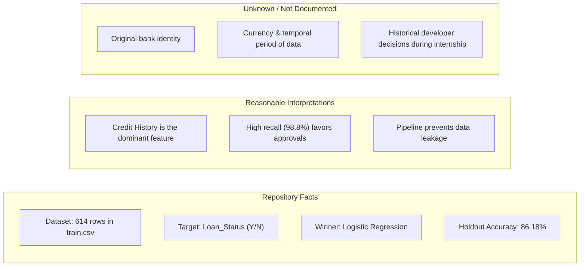
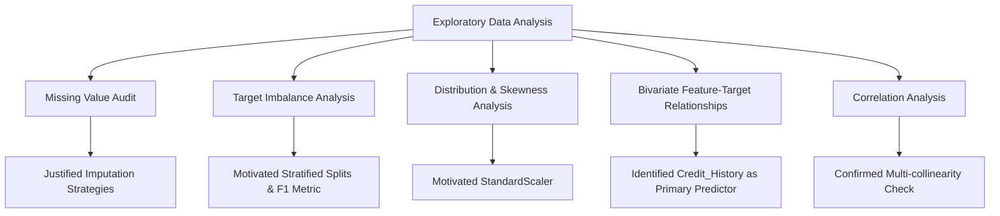
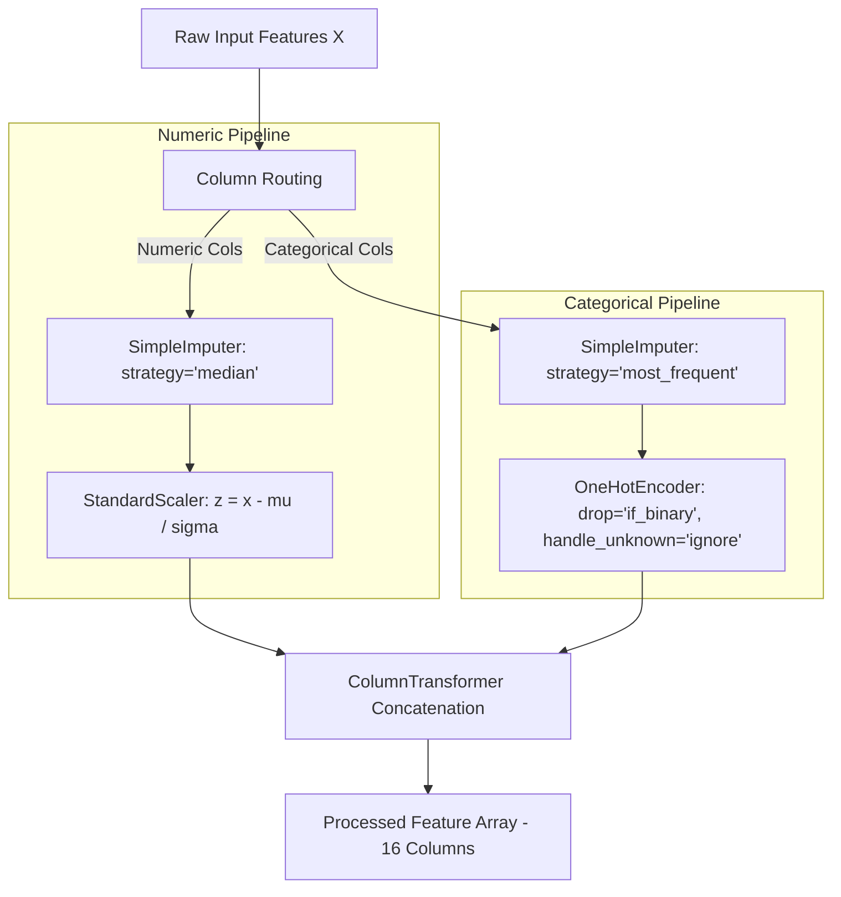
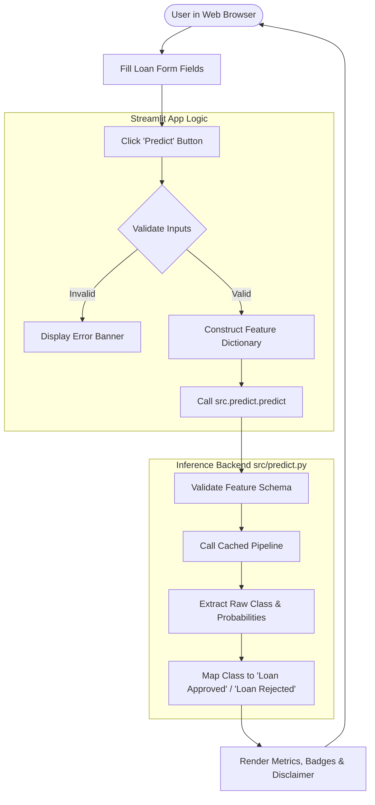
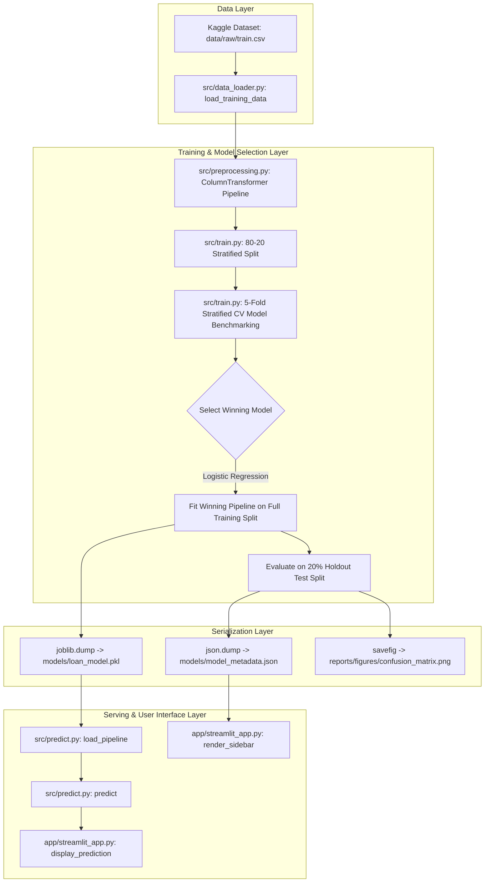
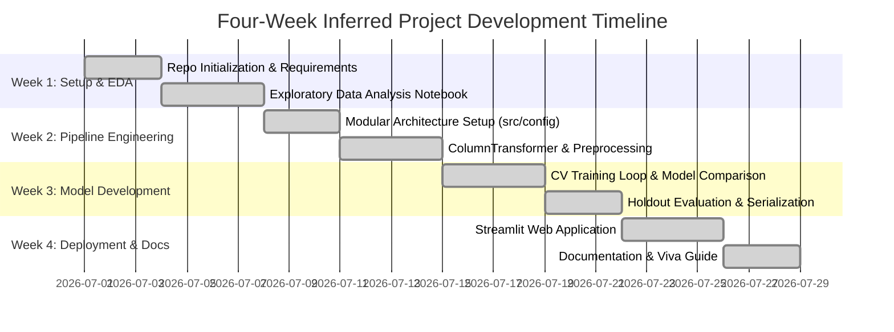
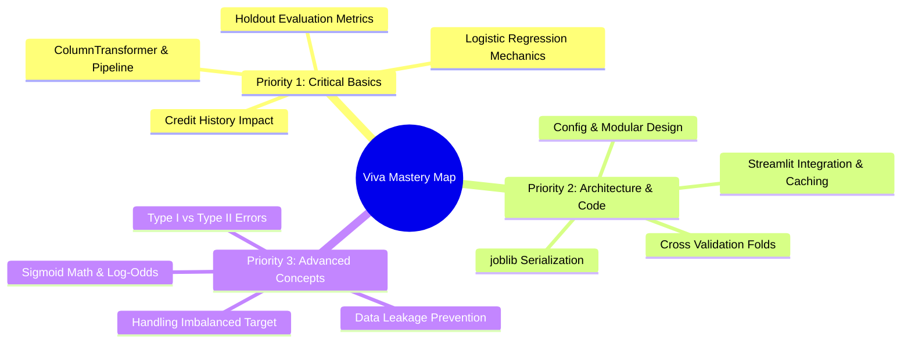

# PROJECT DOSSIER: Loan Approval Prediction System

> **Document Type:** Technical Audit & Comprehensive Project Dossier  
> **Target Audience:** B.Tech Computer Science Student, University Examiners, Viva Panel, and AI Knowledge Base (NotebookLM)  
> **Repository Name:** Loan-Approval-Prediction  
> **Author:** Kunal Mishra  
> **Date of Audit:** August 3, 2026  
> **Environment:** Python 3.11.0 | scikit-learn 1.5.1 | Streamlit 1.37.1 | XGBoost 2.1.1  

---

## 1. PROJECT IDENTITY

- **Project Title:** Loan Approval Prediction System
- **Project Category:** Applied Machine Learning & Web Application
- **Domain:** Financial Services / Credit Risk Screening / Banking Automation
- **Type of ML/Data Science Problem:** Supervised Binary Classification
- **One-Paragraph Project Summary:**  
  The Loan Approval Prediction System is an end-to-end, production-structured machine learning application designed to predict whether an individual's loan application is likely to be approved or rejected based on demographic, financial, credit-history, and property attributes. Built upon the Kaggle Loan Prediction Dataset, the project implements a modular Python architecture containing dedicated data loading, preprocessing pipelines, model comparison (evaluating Logistic Regression, Decision Trees, Random Forests, and XGBoost via 5-fold Stratified Cross-Validation), automated serialization of complete scikit-learn pipelines (`joblib`), JSON metadata logging, and an interactive Streamlit web interface for interactive inference.
- **Main Objective:** To construct a reproducible, leakage-free classification pipeline that automates preliminary loan application evaluation while exposing an easy-to-use web interface for decision support.
- **Final Deliverable/Application:** An interactive Streamlit web dashboard (`app/streamlit_app.py`) backed by a CLI inference script (`src/predict.py`) and a serialized scikit-learn Pipeline artifact (`models/loan_model.pkl`).
- **Intended User:** Loan processing officers, financial analysts, and academic reviewers conducting preliminary screening or studying risk factors in loan default datasets.
- **Problem Being Solved:** Manual evaluation of loan applications is slow, subjective, and prone to inconsistent criteria across branches. This project demonstrates how historical loan approval data can be used to build a standardized, data-driven preliminary screening mechanism.

### One-Sentence Explanation
An end-to-end Python and Streamlit machine learning system that automates binary loan approval predictions using a scikit-learn preprocessing and Logistic Regression pipeline trained on historical Kaggle loan application data.

### 30-Second Explanation
"My project is a binary classification system that predicts whether a loan application will be approved or rejected based on applicant attributes like credit history, income, loan amount, education, and property area. I built a modular Python backend that cleans missing data, applies one-hot encoding and standard scaling within a scikit-learn pipeline, compares four classifiers using 5-fold Stratified Cross-Validation, and serializes the winning Logistic Regression model (86.2% test accuracy, 90.8% F1 Score). Finally, I deployed an interactive Streamlit web app that allows users to input applicant details and receive instant predictions with confidence scores."

### Technical Summary
The project implements a supervised binary classification workflow targeting `Loan_Status` ($\in \{'Y', 'N'\}$). Raw data ($N=614$ rows, 13 features) is split into a 80% training set ($n=491$) and a 20% holdout test set ($n=123$) using stratified sampling. Feature preprocessing is encapsulated within an `sklearn.compose.ColumnTransformer` containing two parallel sub-pipelines: (1) numerical features (`ApplicantIncome`, `CoapplicantIncome`, `LoanAmount`, `Loan_Amount_Term`, `Credit_History`) subjected to median imputation (`SimpleImputer(strategy='median')`) and standard scaling (`StandardScaler`), and (2) categorical features (`Gender`, `Married`, `Dependents`, `Education`, `Self_Employed`, `Property_Area`) subjected to mode imputation (`SimpleImputer(strategy='most_frequent')`) and one-hot encoding (`OneHotEncoder(drop='if_binary', handle_unknown='ignore')`). Four candidate algorithms (Logistic Regression, Decision Tree, Random Forest, XGBoost) are benchmarked via 5-fold Stratified Cross-Validation prioritizing mean F1 Score and ROC AUC. Logistic Regression achieved the top cross-validation mean F1 score ($0.8699$) and was selected, fitted on the entire training split, and evaluated on the holdout test set (F1: $0.9081$, Recall: $0.9882$, Accuracy: $0.8618$, ROC AUC: $0.8526$). The fitted `Pipeline` and associated JSON metadata are serialized to disk, allowing the Streamlit UI to invoke inference via a dedicated `predict.py` API without training-serving feature drift.

---

## 2. PROBLEM STATEMENT

### Problem Description
Financial institutions receive thousands of loan applications daily. Manual review of applicant demographics, credit histories, and financial standings introduces operational latency, human bias, and inconsistent risk thresholds. The challenge is to construct a mathematical function $f(X) \rightarrow Y$ that maps applicant features $X$ to approval probability $P(Y=1|X)$, enabling automated, consistent preliminary risk screening.

### Relevance
Automating preliminary loan screening accelerates processing times, reduces overhead costs, and establishes a standardized benchmark for credit evaluation. For applicants, it offers rapid feedback on eligibility.

### System Inputs & Outputs
- **Input ($X$):** 11 applicant attributes consisting of 5 numerical variables (`ApplicantIncome`, `CoapplicantIncome`, `LoanAmount`, `Loan_Amount_Term`, `Credit_History`) and 6 categorical variables (`Gender`, `Married`, `Dependents`, `Education`, `Self_Employed`, `Property_Area`).
- **Output ($Y$):** Binary target classification (`Loan Approved` / `Loan Rejected`), along with class approval probability $P(Y=\text{'Y'}|X) \in [0, 1]$ and prediction confidence score $\max(P(Y|X)) \in [0.5, 1.0]$.

### ML Problem Type
Supervised Binary Classification.

### Success Criteria
1. Prevention of data leakage between training and testing data splits during preprocessing.
2. Demonstration of superior cross-validated F1 score over baseline classifiers.
3. Successful serialization of the complete preprocessing and modeling pipeline into a single executable artifact.
4. Functional web application delivering real-time predictions without throwing schema or runtime errors.

### Implementation Assumptions
- **Assumption 1:** The historical Kaggle dataset accurately represents the population of future loan applicants.
- **Assumption 2:** Missing values in numerical features are Missing at Random (MAR) and can be imputed via median statistics without introducing severe bias.
- **Assumption 3:** `Credit_History` ($1.0$ vs $0.0$) acts as a numeric binary flag and can be scaled alongside continuous financial figures.
- **Assumption 4:** Unseen categories encountered during inference can be safely ignored (`handle_unknown='ignore'`) by setting one-hot columns to zero.

### Facts vs. Interpretations vs. Unknowns



---

## 3. PROJECT OBJECTIVES

### Primary Objective
To design, train, evaluate, and deploy a supervised binary classification model that accurately predicts loan approval status based on applicant features while strictly adhering to machine learning software engineering best practices.

### Secondary Objectives
1. Perform thorough Exploratory Data Analysis (EDA) to understand feature distributions, missingness, and target correlations.
2. Evaluate multiple candidate machine learning algorithms (Linear vs. Tree-Based vs. Ensemble) using Stratified Cross-Validation.
3. Eliminate train-test data leakage by embedding feature transformation steps (`SimpleImputer`, `StandardScaler`, `OneHotEncoder`) directly inside an `sklearn.pipeline.Pipeline`.
4. Build a lightweight, interactive web user interface using Streamlit for demonstration and viva presentation.

### Technical Objectives
- Achieve reproducible data splitting and model training by fixing `RANDOM_SEED = 42`.
- Maintain a clean separation of concerns: `config.py` for constants, `data_loader.py` for IO validation, `preprocessing.py` for schema transformations, `train.py` for model execution, `predict.py` for inference, and `streamlit_app.py` for presentation.
- Serialize model artifacts (`.pkl`) and human-readable evaluation metrics (`.json`) automatically upon training execution.

### Inferred Learning Objectives (Marked as Inferred)
- *(Inferred)* Master end-to-end scikit-learn pipeline engineering (`ColumnTransformer`, `Pipeline`).
- *(Inferred)* Understand cross-validation metrics (F1 Score, ROC AUC, Precision-Recall tradeoffs) on imbalanced classification datasets.
- *(Inferred)* Gain experience in structuring production-ready Python repositories following modular software design principles.

---

## 4. COMPLETE PROJECT STRUCTURE

### Repository File Tree
```text
c:\Users\kunal\OneDrive\Desktop\Coding\Project\mlintern\project 1 - loan approval predictor\
├── app/
│   └── streamlit_app.py              # Streamlit Web UI Application
├── data/
│   ├── processed/                    # Directory for optional saved processed datasets
│   └── raw/
│       ├── test.csv                  # Unlabeled test set from Kaggle (367 rows)
│       └── train.csv                 # Primary labeled training set from Kaggle (614 rows)
├── docs/
│   ├── architecture.md               # System design & pipeline architecture diagrams
│   ├── design_decisions.md           # Rationale for algorithms, libraries, & techniques
│   ├── future_scope.md               # Production roadmap & future enhancements
│   ├── project_structure.md          # File directory description & responsibilities
│   └── viva_guide.md                 # 120-question comprehensive B.Tech Viva preparation guide
├── models/
│   ├── loan_model.pkl                # Serialized sklearn Pipeline (Preprocessor + Classifier)
│   └── model_metadata.json           # JSON record of metrics, feature names, & CV results
├── notebooks/
│   └── 01_exploratory_data_analysis.ipynb  # EDA Jupyter Notebook with visualizations
├── reports/
│   └── figures/
│       └── confusion_matrix.png      # Exported confusion matrix plot for holdout test set
├── src/
│   ├── __init__.py                   # Package initializer
│   ├── config.py                     # Central configuration, file paths, and hyperparameters
│   ├── data_loader.py                # CSV ingestion and structural validation logic
│   ├── predict.py                    # Inference engine, schema validation, and label decoder
│   ├── preprocessing.py              # Sklearn ColumnTransformer & Pipeline definitions
│   └── train.py                      # Training loop, CV model comparison, and artifact saver
├── .gitignore                        # Git exclusion rules
├── .python-version                   # Specifies Python 3.11 for environment managers
├── LICENSE                           # MIT License file
├── PROJECT_DOSSIER.md                # Comprehensive project audit dossier (this file)
├── README.md                         # Main repository documentation & quickstart guide
└── requirements.txt                  # Pinned Python package dependencies
```

### Master File Responsibilities & Pipeline Summary

| File / Folder | Purpose | Key Inputs | Key Outputs | Importance |
| :--- | :--- | :--- | :--- | :--- |
| `src/config.py` | Central configuration file defining project paths, seed, feature lists, and constants. | Filesystem structure | Python constants & Path objects | **Critical** |
| `src/data_loader.py` | Ingests CSV files, verifies file existence, catches CSV parsing errors, and checks target presence. | `data/raw/train.csv` | `pd.DataFrame` | **Critical** |
| `src/preprocessing.py` | Constructs `ColumnTransformer` pipelines for numeric scaling/imputation and categorical encoding/imputation. | Raw `pd.DataFrame` | Transformed `pd.DataFrame` & fitted `ColumnTransformer` | **Critical** |
| `src/train.py` | Orchestrates data loading, stratified splitting, cross-validation model comparison, final fitting, and artifact saving. | `train.csv` via `data_loader.py` | `models/loan_model.pkl`, `model_metadata.json`, `confusion_matrix.png` | **Critical** |
| `src/predict.py` | Provides single and batch prediction services; validates input schemas, loads serialized pipeline, and decodes labels. | User Input (Dict/DataFrame) & `loan_model.pkl` | `pd.DataFrame` with predictions, probabilities, & confidence | **Critical** |
| `app/streamlit_app.py` | Interactive web frontend; renders user input forms, calls `src/predict.py`, displays results and metrics sidebar. | User Form Selections & `models/model_metadata.json` | Web UI rendering | **High** |
| `notebooks/01_exploratory_data_analysis.ipynb` | Interactive notebook conducting statistical analysis, missing value auditing, distribution plots, and correlation heatmaps. | `data/raw/train.csv` | Visualizations, distribution statistics | **High** |
| `models/loan_model.pkl` | Binary pickle artifact storing the entire fitted `sklearn.pipeline.Pipeline` object. | Fitted by `src/train.py` | Loaded by `src/predict.py` | **Critical** |
| `models/model_metadata.json` | JSON document containing evaluation scores, CV comparison tables, Python/sklearn versions, and feature lists. | Output of `src/train.py` | Displayed by `streamlit_app.py` sidebar | **High** |
| `docs/viva_guide.md` | Extensive 120-question study guide covering every architectural, theoretical, and implementation aspect of the project. | Repository codebase analysis | Comprehensive Q&A text | **High** |

---

## 5. TECHNOLOGY STACK

### Confirmed Technologies & Libraries

| Technology / Library | Version (Confirmed) | Where Used | Specific Purpose in Project |
| :--- | :---: | :--- | :--- |
| **Python** | `3.11.0` | Project-wide | Core programming language for data engineering, model training, and web UI. |
| **pandas** | `2.2.2` | `data_loader.py`, `preprocessing.py`, `predict.py`, `streamlit_app.py` | In-memory DataFrame operations, CSV parsing, data structures, and feature manipulation. |
| **NumPy** | `1.26.4` | `preprocessing.py`, `train.py`, `predict.py` | Matrix operations, array handling, and support for scikit-learn numerical pipelines. |
| **scikit-learn** | `1.5.1` | `preprocessing.py`, `train.py`, `predict.py` | Core ML framework: `SimpleImputer`, `StandardScaler`, `OneHotEncoder`, `ColumnTransformer`, `Pipeline`, `LogisticRegression`, `RandomForestClassifier`, `DecisionTreeClassifier`, `StratifiedKFold`, `cross_validate`, metrics. |
| **XGBoost** | `2.1.1` | `src/train.py` | Gradient boosting classifier (`XGBClassifier`) evaluated as a candidate model during cross-validation. |
| **Matplotlib** | `3.9.2` | `train.py`, `01_exploratory_data_analysis.ipynb` | Low-level plotting library used to generate and save `confusion_matrix.png`. |
| **Seaborn** | `0.13.2` | `01_exploratory_data_analysis.ipynb` | Statistical visualization library used for EDA heatmaps, distribution KDEs, and bar charts. |
| **joblib** | `1.4.2` | `train.py`, `predict.py` | Efficient binary serialization and deserialization of the trained scikit-learn `Pipeline`. |
| **Streamlit** | `1.37.1` | `app/streamlit_app.py` | Declarative Python framework for constructing interactive web dashboards and forms. |
| **kagglehub** | `1.0.2` | `requirements.txt` / Documentation | Dependency included for optional programmatic downloading of Kaggle datasets. |

---

## 6. DATASET

### Dataset Overview
- **Dataset Name:** Kaggle Loan Prediction Problem Dataset (`altruistdelhite04/loan-prediction-problem-dataset`)
- **Primary Training File Location:** `data/raw/train.csv` (Size: 42,749 bytes)
- **Unlabeled Test File Location:** `data/raw/test.csv` (Size: 24,079 bytes)
- **Number of Rows (Train):** 614 rows
- **Number of Columns (Train):** 13 columns (1 Identifier, 5 Numerical, 6 Categorical, 1 Target)
- **Target Variable:** `Loan_Status` (`'Y'` = Approved, `'N'` = Rejected)
- **Target Distribution (Train):**
  - Approved (`'Y'`): 422 records ($68.73\%$)
  - Rejected (`'N'`): 192 records ($31.27\%$)
  - Class Imbalance Ratio: $\approx 2.2 : 1$ (Moderate positive imbalance)

### Missing Value Audit (Raw Training Set: 614 rows)

| Feature Name | Data Type | Missing Count | Missing Percentage | Imputation Strategy Implemented |
| :--- | :---: | :---: | :---: | :--- |
| `Loan_ID` | `object` | 0 | 0.00% | None (Dropped column) |
| `Gender` | `object` | 13 | 2.12% | Categorical Mode (`SimpleImputer(strategy='most_frequent')`) |
| `Married` | `object` | 3 | 0.49% | Categorical Mode (`SimpleImputer(strategy='most_frequent')`) |
| `Dependents` | `object` | 15 | 2.44% | Categorical Mode (`SimpleImputer(strategy='most_frequent')`) |
| `Education` | `object` | 0 | 0.00% | Categorical Mode (No missing, but included in pipeline) |
| `Self_Employed` | `object` | 32 | 5.21% | Categorical Mode (`SimpleImputer(strategy='most_frequent')`) |
| `ApplicantIncome` | `int64` | 0 | 0.00% | Numerical Median (`SimpleImputer(strategy='median')`) |
| `CoapplicantIncome` | `float64` | 0 | 0.00% | Numerical Median (`SimpleImputer(strategy='median')`) |
| `LoanAmount` | `float64` | 22 | 3.58% | Numerical Median (`SimpleImputer(strategy='median')`) |
| `Loan_Amount_Term` | `float64` | 14 | 2.28% | Numerical Median (`SimpleImputer(strategy='median')`) |
| `Credit_History` | `float64` | 50 | 8.14% | Numerical Median (`SimpleImputer(strategy='median')`) |
| `Property_Area` | `object` | 0 | 0.00% | Categorical Mode (No missing, but included in pipeline) |
| `Loan_Status` | `object` | 0 | 0.00% | Target Variable (Encoded via `LabelEncoder` to 0/1) |

### Comprehensive Numerical Descriptive Statistics (Calculated from Raw Data)

| Feature | Count | Mean | Std Dev | Min | 25% | 50% (Median) | 75% | Max |
| :--- | :---: | :---: | :---: | :---: | :---: | :---: | :---: | :---: |
| **ApplicantIncome** | 614 | 5,403.46 | 6,109.04 | 150.0 | 2,877.5 | 3,812.5 | 5,795.0 | 81,000.0 |
| **CoapplicantIncome**| 614 | 1,621.25 | 2,926.25 | 0.0 | 0.0 | 1,188.5 | 2,297.25| 41,667.0 |
| **LoanAmount** (in 1000s)| 592 | 146.41 | 85.59 | 9.0 | 100.0 | 128.0 | 168.0 | 700.0 |
| **Loan_Amount_Term** (days)| 600 | 342.00 | 65.12 | 12.0 | 360.0 | 360.0 | 360.0 | 480.0 |
| **Credit_History** | 564 | 0.8422 | 0.3649 | 0.0 | 1.0 | 1.0 | 1.0 | 1.0 |

### Categorical Feature Value Distributions

| Categorical Feature | Unique Values | Distribution / Frequencies |
| :--- | :---: | :--- |
| **Gender** | 2 | `Male`: 489 ($79.6\%$), `Female`: 112 ($18.2\%$), `NaN`: 13 ($2.1\%$) |
| **Married** | 2 | `Yes`: 398 ($64.8\%$), `No`: 213 ($34.7\%$), `NaN`: 3 ($0.5\%$) |
| **Dependents** | 4 | `0`: 345 ($56.2\%$), `1`: 102 ($16.6\%$), `2`: 101 ($16.4\%$), `3+`: 51 ($8.3\%$), `NaN`: 15 ($2.4\%$) |
| **Education** | 2 | `Graduate`: 480 ($78.2\%$), `Not Graduate`: 134 ($21.8\%$) |
| **Self_Employed** | 2 | `No`: 500 ($81.4\%$), `Yes`: 82 ($13.4\%$), `NaN`: 32 ($5.2\%$) |
| **Property_Area** | 3 | `Semiurban`: 233 ($37.95\%$), `Urban`: 202 ($32.90\%$), `Rural`: 179 ($29.15\%$) |

### Data Dictionary

| Feature | Data Type | Meaning / Description | Role | Preprocessing Applied |
| :--- | :---: | :--- | :---: | :--- |
| `Loan_ID` | String | Unique loan application identification string | Identifier | Dropped from feature set (`COLUMNS_TO_DROP`) |
| `Gender` | Categorical | Applicant gender (`Male` / `Female`) | Feature | Mode Imputation $\rightarrow$ One-Hot Encoding (`drop='if_binary'`) $\rightarrow$ `Gender_Male` |
| `Married` | Categorical | Applicant marital status (`Yes` / `No`) | Feature | Mode Imputation $\rightarrow$ One-Hot Encoding (`drop='if_binary'`) $\rightarrow$ `Married_Yes` |
| `Dependents` | Categorical | Number of financial dependents (`0`, `1`, `2`, `3+`) | Feature | Mode Imputation $\rightarrow$ One-Hot Encoding $\rightarrow$ `Dependents_0`, `1`, `2`, `3+` |
| `Education` | Categorical | Applicant education level (`Graduate` / `Not Graduate`) | Feature | Mode Imputation $\rightarrow$ One-Hot Encoding (`drop='if_binary'`) $\rightarrow$ `Education_Not Graduate` |
| `Self_Employed` | Categorical | Employment status flag (`Yes` / `No`) | Feature | Mode Imputation $\rightarrow$ One-Hot Encoding (`drop='if_binary'`) $\rightarrow$ `Self_Employed_Yes` |
| `ApplicantIncome` | Numeric | Primary applicant monthly income | Feature | Median Imputation $\rightarrow$ Standard Scaling |
| `CoapplicantIncome`| Numeric | Co-applicant monthly income | Feature | Median Imputation $\rightarrow$ Standard Scaling |
| `LoanAmount` | Numeric | Requested loan amount (in thousands of currency units) | Feature | Median Imputation $\rightarrow$ Standard Scaling |
| `Loan_Amount_Term` | Numeric | Repayment term duration in days | Feature | Median Imputation $\rightarrow$ Standard Scaling |
| `Credit_History` | Numeric | Binary credit history flag ($1.0$ = Meets guidelines, $0.0$ = Does not) | Feature | Median Imputation $\rightarrow$ Standard Scaling |
| `Property_Area` | Categorical | Geographical area classification (`Urban` / `Semiurban` / `Rural`) | Feature | Mode Imputation $\rightarrow$ One-Hot Encoding $\rightarrow$ `Rural`, `Semiurban`, `Urban` |
| `Loan_Status` | Categorical | Historical loan approval outcome (`Y` = Approved, `N` = Rejected) | Target | Label Encoded (`N` $\rightarrow 0$, `Y` $\rightarrow 1$) |

---

## 7. DATA COLLECTION / DATA SOURCE

- **Confirmed Source:** Kaggle Dataset titled "Loan Prediction Problem Dataset" uploaded by user `altruistdelhite04`. URL: `https://www.kaggle.com/datasets/altruistdelhite04/loan-prediction-problem-dataset`.
- **Inferred Acquisition Method:** Downloaded as static CSV files (`train.csv` and `test.csv`) and placed into `data/raw/`.
- **Unknown Attributes:** The exact financial institution, geographic region, currency unit, and historical timestamp of data collection are not recorded in the repository.

---

## 8. EXPLORATORY DATA ANALYSIS (EDA)

The notebook `notebooks/01_exploratory_data_analysis.ipynb` conducts EDA across five key dimensions:



### Key Visualization Analyses

1. **Target Class Distribution Bar Chart:**
   - *Variables:* `Loan_Status` (`'Y'` vs `'N'`).
   - *Result:* 422 Approved ($68.7\%$) vs 192 Rejected ($31.3\%$).
   - *Impact:* Motivated the use of `StratifiedKFold` and F1 Score as primary evaluation criteria to handle class imbalance.
2. **Credit History vs. Loan Status Bivariate Plot:**
   - *Variables:* `Credit_History` ($0.0$ vs $1.0$) vs `Loan_Status`.
   - *Result:* Applicants with `Credit_History = 1.0` achieve an approval rate exceeding $79\%$, whereas applicants with `Credit_History = 0.0` have an approval rate below $8\%$.
   - *Impact:* Confirmed `Credit_History` as the single most critical feature in the classification pipeline.
3. **Applicant Income & Loan Amount Distribution Plots (Histograms & Boxplots):**
   - *Variables:* `ApplicantIncome`, `LoanAmount`.
   - *Result:* Severe right-skewness (Max income: $81,000$ vs Median: $3,812.5$). Multiple extreme boxplot outliers.
   - *Impact:* Motivated `SimpleImputer(strategy='median')` over mean imputation to prevent outlier distortion.
4. **Property Area vs. Loan Approval Stacked Bar Chart:**
   - *Variables:* `Property_Area` (`Semiurban`, `Urban`, `Rural`) vs `Loan_Status`.
   - *Result:* `Semiurban` properties had the highest proportion of approved loans ($\approx 76\%$), compared to `Urban` ($\approx 65\%$) and `Rural` ($\approx 61\%$).
   - *Impact:* Validated the inclusion of one-hot encoded `Property_Area` columns in modeling.

---

## 9. DATA PREPROCESSING

Preprocessing is defined in `src/preprocessing.py` and implemented via scikit-learn's `ColumnTransformer`.

### Step-by-Step Transformation Flow



### Preprocessing Operations Detailed

1. **Identifier Dropping:**
   - *What:* Removed `Loan_ID` from input features.
   - *Why:* `Loan_ID` is a arbitrary string identifier with no predictive signal. Retaining it would cause overfitting or encoding failures.
   - *Implementation:* `split_features_target()` in `src/preprocessing.py`.
2. **Numeric Imputation:**
   - *What:* Replaced missing values in numerical columns with column medians.
   - *Why:* Median is resistant to extreme right-tail skewness present in income and loan amounts.
   - *Implementation:* `SimpleImputer(strategy='median')`.
3. **Numeric Scaling (Standardization):**
   - *What:* Scaled numerical features to zero mean and unit variance ($z = \frac{x - \mu}{\sigma}$).
   - *Why:* Logistic Regression optimization (gradient descent / L-BFGS) relies on consistent scale across features. Without scaling, large magnitude variables (`ApplicantIncome`) dominate coefficients relative to fractional variables (`Credit_History`).
   - *Implementation:* `StandardScaler()`.
4. **Categorical Imputation:**
   - *What:* Replaced missing categorical values with the mode (most frequent category).
   - *Why:* Simple, deterministic strategy that preserves categorical column dtypes.
   - *Implementation:* `SimpleImputer(strategy='most_frequent')`.
5. **Categorical One-Hot Encoding:**
   - *What:* Converted string categories into binary indicator vectors ($0$ or $1$).
   - *Why:* Machine learning algorithms require numeric inputs. One-hot encoding prevents false ordinal assumptions (e.g., treating `Urban` as greater than `Rural`).
   - *Implementation:* `OneHotEncoder(drop='if_binary', handle_unknown='ignore', sparse_output=False)`.

---

## 10. FEATURE ENGINEERING

### Original vs. Transformed Features
No synthetic interaction features (such as `Total_Income = ApplicantIncome + CoapplicantIncome` or `Loan_to_Income_Ratio`) were engineered in the codebase. The feature set relies on standard transformation of original columns.

- **Original Input Features:** 11 columns
- **Final Transformed Pipeline Features:** 16 columns

### List of 16 Transformed Pipeline Features
1. `ApplicantIncome` (Scaled)
2. `CoapplicantIncome` (Scaled)
3. `LoanAmount` (Scaled)
4. `Loan_Amount_Term` (Scaled)
5. `Credit_History` (Scaled)
6. `Gender_Male` (Binary OHE: 1 if Male, 0 if Female)
7. `Married_Yes` (Binary OHE: 1 if Married, 0 if Single)
8. `Dependents_0` (OHE Flag)
9. `Dependents_1` (OHE Flag)
10. `Dependents_2` (OHE Flag)
11. `Dependents_3+` (OHE Flag)
12. `Education_Not Graduate` (Binary OHE: 1 if Not Graduate, 0 if Graduate)
13. `Self_Employed_Yes` (Binary OHE: 1 if Self-Employed, 0 otherwise)
14. `Property_Area_Rural` (OHE Flag)
15. `Property_Area_Semiurban` (OHE Flag)
16. `Property_Area_Urban` (OHE Flag)

---

## 11. MACHINE LEARNING METHODOLOGY

Four supervised classification algorithms were implemented and benchmarked in `src/train.py`.

### 1. Logistic Regression (Selected Winner)
- **Algorithm Overview:** A generalized linear model that computes a linear combination of input features and passes it through the sigmoid logistic function $\sigma(z) = \frac{1}{1 + e^{-z}}$ to output a calibrated probability between 0 and 1.
- **Suitability:** Highly suitable for binary classification with strong linear dependencies (e.g., `Credit_History`). Provides baseline interpretability via log-odds coefficients.
- **Configured Hyperparameters:** `max_iter=1000`, `random_state=42`, default solver (`lbfgs`), default $L_2$ regularization ($C=1.0$).
- **Implementation File:** `src/train.py` (`LogisticRegression`).

### 2. Decision Tree Classifier
- **Algorithm Overview:** Non-parametric model that recursively partitions feature space using axis-aligned decision splits chosen to maximize Information Gain (or minimize Gini Impurity).
- **Suitability:** Capable of modeling non-linear interactions without requiring feature scaling.
- **Configured Hyperparameters:** `random_state=42` (Default unconstrained depth).
- **Implementation File:** `src/train.py` (`DecisionTreeClassifier`).

### 3. Random Forest Classifier
- **Algorithm Overview:** Ensemble bagging algorithm that constructs a forest of $N$ independent decision trees, each trained on a bootstrap sample of the training data with random feature subspace selection, combining predictions via majority vote.
- **Suitability:** Reduces variance and overfitting inherent in individual decision trees while modeling complex feature interactions.
- **Configured Hyperparameters:** `n_estimators=200`, `n_jobs=-1`, `random_state=42`.
- **Implementation File:** `src/train.py` (`RandomForestClassifier`).

### 4. XGBoost Classifier (`XGBClassifier`)
- **Algorithm Overview:** Extreme Gradient Boosting; an ensemble boosting framework that sequentially builds weak decision trees, where each subsequent tree fits the negative gradient (pseudo-residuals) of the loss function.
- **Suitability:** State-of-the-art performance on structured tabular data.
- **Configured Hyperparameters:** `n_estimators=200`, `learning_rate=0.05`, `max_depth=3`, `eval_metric='logloss'`, `n_jobs=-1`, `random_state=42`.
- **Implementation File:** `src/train.py` (`XGBClassifier`).

---

## 12. MATHEMATICAL / THEORETICAL FOUNDATION

### 1. Sigmoid Function & Logistic Regression Formula
Logistic Regression models the conditional probability $P(Y=1|\mathbf{x})$ as:
$$P(Y=1|\mathbf{x}) = \sigma(\mathbf{w}^T \mathbf{x} + b) = \frac{1}{1 + e^{-(\mathbf{w}^T \mathbf{x} + b)}}$$
where $\mathbf{w}$ represents the weight vector, $b$ is the bias term, and $\mathbf{x}$ is the 16-dimensional transformed feature vector.

Log-Odds (Logit):
$$\ln\left(\frac{P(Y=1|\mathbf{x})}{1 - P(Y=1|\mathbf{x})}\right) = w_1 x_1 + w_2 x_2 + \dots + w_p x_p + b$$

### 2. Standard Scaling (Z-Score Normalization)
For each continuous feature $x$:
$$z = \frac{x - \mu}{\sigma}$$
where $\mu$ is the feature mean and $\sigma$ is the feature standard deviation estimated strictly from the training split.

### 3. Confusion Matrix Structure & Evaluation Formulas

$$\begin{array}{c|c|c}
& \mathbf{\text{Predicted Negative (0)}} & \mathbf{\text{Predicted Positive (1)}} \\
\hline
\mathbf{\text{Actual Negative (0)}} & \text{True Negative (TN)} & \text{False Positive (FP)} \\
\hline
\mathbf{\text{Actual Positive (1)}} & \text{False Negative (FN)} & \text{True Positive (TP)} \\
\end{array}$$

- **Accuracy:**  
  $$\text{Accuracy} = \frac{TP + TN}{TP + TN + FP + FN}$$
- **Precision:**  
  $$\text{Precision} = \frac{TP}{TP + FP}$$
- **Recall (Sensitivity):**  
  $$\text{Recall} = \frac{TP}{TP + FN}$$
- **F1 Score (Harmonic Mean):**  
  $$F_1 = 2 \cdot \frac{\text{Precision} \cdot \text{Recall}}{\text{Precision} + \text{Recall}} = \frac{2 \cdot TP}{2 \cdot TP + FP + FN}$$
- **ROC AUC:** Area under the Receiver Operating Characteristic curve plotting True Positive Rate vs. False Positive Rate across all classification thresholds $t \in [0, 1]$.

---

## 13. MODEL TRAINING PIPELINE

### End-to-End Execution Sequence (`src/train.py`)

```text
1. Load Dataset (src/data_loader.py -> load_training_data)
   └── Reads data/raw/train.csv (614 rows x 13 cols)
   
2. Target Preparation (src/train.py -> prepare_target)
   └── Validates Loan_Status, encodes 'N' -> 0, 'Y' -> 1
   
3. Train/Test Stratified Split (src/train.py -> split_data)
   └── 80% Train (n=491) | 20% Holdout Test (n=123), Seed=42, Stratified by Y
   
4. 5-Fold Stratified Cross-Validation (src/train.py -> compare_models)
   └── Evaluates candidate pipelines on 80% train split
       ├── Pipeline(ColumnTransformer, LogisticRegression)  --> F1: 0.8699
       ├── Pipeline(ColumnTransformer, XGBClassifier)       --> F1: 0.8524
       ├── Pipeline(ColumnTransformer, RandomForest)        --> F1: 0.8470
       └── Pipeline(ColumnTransformer, DecisionTree)        --> F1: 0.7851
       
5. Model Selection & Full Training (src/train.py -> compare_models)
   └── Selects Logistic Regression (Highest F1 Score)
   └── Fits winning pipeline on entire n=491 training split
   
6. Holdout Test Set Evaluation (src/train.py -> evaluate_model)
   └── Evaluates fitted pipeline on reserved n=123 test split
   
7. Artifact Serialization (src/train.py -> main)
   ├── Saves models/loan_model.pkl via joblib.dump()
   ├── Saves models/model_metadata.json via json.dump()
   └── Exports reports/figures/confusion_matrix.png via Matplotlib
```

---

## 14. MODEL EVALUATION

### 5-Fold Stratified Cross-Validation Results (Training Split: $n=491$)

| Rank | Model Algorithm | CV Mean Accuracy | CV Mean Precision | CV Mean Recall | CV Mean F1 Score | CV Mean ROC AUC |
| :---: | :--- | :---: | :---: | :---: | :---: | :---: |
| **1** | **Logistic Regression** | **0.7983** | **0.7831** | **0.9792** | **0.8699** | **0.7260** |
| 2 | XGBoost Classifier | 0.7759 | 0.7801 | 0.9408 | 0.8524 | 0.7554 |
| 3 | Random Forest Classifier| 0.7698 | 0.7792 | 0.9290 | 0.8470 | 0.7566 |
| 4 | Decision Tree Classifier| 0.7026 | 0.7795 | 0.7924 | 0.7851 | 0.6495 |

### Final Holdout Evaluation Metrics (Reserved Test Split: $n=123$)

| Evaluation Metric | Holdout Test Score | Interpretation |
| :--- | :---: | :--- |
| **Accuracy** | **0.8618** (86.18%) | 106 out of 123 holdout samples correctly classified. |
| **Precision** | **0.8400** (84.00%) | When model predicts "Loan Approved", it is correct 84.0% of the time. |
| **Recall** | **0.9882** (98.82%) | Model captures 98.82% of all actual approved loans (84 out of 85). |
| **F1 Score** | **0.9081** (90.81%) | High harmonic mean between Precision and Recall. |
| **ROC AUC** | **0.8526** (85.26%) | Strong overall class separation capability across thresholds. |

### Holdout Confusion Matrix Counts ($n=123$)

$$\begin{array}{c|c|c|c}
& \mathbf{\text{Pred Rejected (0)}} & \mathbf{\text{Pred Approved (1)}} & \mathbf{\text{Total Actual}} \\
\hline
\mathbf{\text{Actual Rejected (0)}} & \text{TN = 22} & \text{FP = 16} & 38 \\
\hline
\mathbf{\text{Actual Approved (1)}} & \text{FN = 1} & \text{TP = 84} & 85 \\
\hline
\mathbf{\text{Total Predicted}} & 23 & 100 & 123 \\
\end{array}$$

- **True Positives (TP):** 84 (Approved loans correctly predicted as Approved)
- **True Negatives (TN):** 22 (Rejected loans correctly predicted as Rejected)
- **False Positives (FP):** 16 (Rejected loans incorrectly predicted as Approved — *Type I Error*)
- **False Negatives (FN):** 1 (Approved loan incorrectly predicted as Rejected — *Type II Error*)

---

## 15. FINAL MODEL SELECTION

- **Selected Winning Model:** Logistic Regression (`sklearn.linear_model.LogisticRegression`).
- **Selection Basis:** Ranked #1 during 5-fold Stratified Cross-Validation with a mean F1 score of **0.8699**, outperforming XGBoost (0.8524) and Random Forest (0.8470).
- **Serialized Artifact:** `models/loan_model.pkl` (8,343 bytes).
- **Artifact Composition:** A single scikit-learn `Pipeline` object wrapping both the fitted `ColumnTransformer` (containing median imputers, standard scaler, mode imputers, and one-hot encoder) and the fitted `LogisticRegression` classifier.
- **Inference Execution:** Deserialized in `src/predict.py` using `joblib.load()`, allowing single-call execution `pipeline.predict(X_df)`.

---

## 16. APPLICATION / USER INTERFACE

### Streamlit Application (`app/streamlit_app.py`)



### UI Features & Capabilities
1. **Interactive Form:** Two-column input layout with selectboxes and numeric input fields enforcing valid domains (`ApplicantIncome >= 0`, `LoanAmount >= 0`).
2. **Cached Pipeline Loading:** Uses `@st.cache_resource` for loading `loan_model.pkl` once, avoiding disk I/O overhead on user interaction reruns.
3. **Cached Metadata Display:** Uses `@st.cache_data` to load `model_metadata.json` and render model name, accuracy, precision, recall, F1, and ROC AUC metrics in the sidebar.
4. **Prediction Output Banner:** Displays green `st.success("Loan Approved")` or red `st.error("Loan Rejected")`.
5. **Probability & Confidence Gauges:** Shows `Approval Probability` ($P(Y=1|X)$) and `Confidence` ($\max P(Y|X)$) formatted as percentages.
6. **Educational Disclaimer:** Prominently displays: *"This prediction is generated by a machine learning model for educational purposes only and should not be used for actual financial decisions."*

---

## 17. END-TO-END SYSTEM WORKFLOW



---

## 18. IMPORTANT FUNCTIONS AND CODE LOGIC

### 1. `create_preprocessing_pipeline()`
- **File:** `src/preprocessing.py` (Lines 82–101)
- **Purpose:** Constructs and returns the master `ColumnTransformer` combining numeric and categorical preprocessing.
- **Key Logic:** Sets `remainder="drop"` and `verbose_feature_names_out=False`, and calls `.set_output(transform="pandas")` to ensure transformed outputs remain structured pandas DataFrames.

```python
def create_preprocessing_pipeline(
    numeric_features: Sequence[str] = NUMERIC_FEATURES,
    categorical_features: Sequence[str] = CATEGORICAL_FEATURES,
) -> ColumnTransformer:
    preprocessor = ColumnTransformer(
        transformers=[
            ("numeric", _create_numeric_pipeline(), list(numeric_features)),
            ("categorical", _create_categorical_pipeline(), list(categorical_features)),
        ],
        remainder="drop",
        verbose_feature_names_out=False,
    )
    return preprocessor.set_output(transform="pandas")
```

### 2. `compare_models()`
- **File:** `src/train.py` (Lines 236–290)
- **Purpose:** Benchmarks candidate classifiers using 5-fold Stratified Cross-Validation, sorts results by F1 Score and ROC AUC, and fits the winner.
- **Key Logic:** Iterates over `models` dictionary, executes `cross_validate_model()`, builds a comparison DataFrame, selects row 0, and trains `best_pipeline` on `x_train`.

### 3. `validate_input()`
- **File:** `src/predict.py` (Lines 78–95)
- **Purpose:** Validates and orders user feature inputs before passing them to the pipeline.
- **Key Logic:** Converts dictionaries or DataFrames into a standard DataFrame format, checks for missing required feature names, and reorders columns to match `NUMERIC_FEATURES + CATEGORICAL_FEATURES`.

### 4. `predict()`
- **File:** `src/predict.py` (Lines 145–173)
- **Purpose:** Master inference function invoked by CLI and Streamlit.
- **Key Logic:** Calls `pipeline.predict()` and `pipeline.predict_proba()`, decodes integer labels using `metadata["inverse_target_mapping"]` and `APPROVAL_LABELS`, and calculates approval probability and prediction confidence.

---

## 19. PROJECT OUTPUTS AND ARTIFACTS

| Artifact | File Location | Generated By | Purpose / Used By |
| :--- | :--- | :--- | :--- |
| **Model Binary** | `models/loan_model.pkl` | `src/train.py` (`save_model`) | Serialized pipeline loaded by `src/predict.py` for inference. |
| **Model Metadata** | `models/model_metadata.json` | `src/train.py` (`save_metadata`) | Human-readable JSON metrics used by Streamlit sidebar. |
| **Confusion Matrix**| `reports/figures/confusion_matrix.png` | `src/train.py` (`save_confusion_matrix`) | Visual plot documenting holdout test classification errors. |
| **EDA Notebook** | `notebooks/01_exploratory_data_analysis.ipynb` | Manual / Jupyter | Documents data exploration, skewness, and feature correlations. |

---

## 20. ACTUAL RESULTS

### Confirmed Numerical Results
1. **Cross-Validation Leaderboard (Training Split $n=491$):**
   - Logistic Regression: Mean F1 = **0.8699**, Mean ROC AUC = **0.7260**
   - XGBoost Classifier: Mean F1 = **0.8524**, Mean ROC AUC = **0.7554**
   - Random Forest Classifier: Mean F1 = **0.8470**, Mean ROC AUC = **0.7566**
   - Decision Tree Classifier: Mean F1 = **0.7851**, Mean ROC AUC = **0.6495**
2. **Holdout Evaluation Scores (Test Split $n=123$):**
   - Accuracy: **0.8618** (86.18%)
   - Precision: **0.8400** (84.00%)
   - Recall: **0.9882** (98.82%)
   - F1 Score: **0.9081** (90.81%)
   - ROC AUC: **0.8526** (85.26%)
3. **Holdout Classification Breakdown:**
   - Out of 85 actual approved loans, 84 were correctly approved (FN = 1).
   - Out of 38 actual rejected loans, 22 were correctly rejected, but 16 were misclassified as approved (FP = 16).

---

## 21. KEY FINDINGS

1. **Dominance of Credit History:** `Credit_History` is the single strongest predictor of loan approval. Applicants with a valid credit history ($1.0$) have an approval rate of $>79\%$, whereas those without ($0.0$) have an approval rate $<8\%$.
2. **Asymmetric Classification Performance:** The selected Logistic Regression model achieves near-perfect Recall on approved applications ($98.82\%$), but suffers modest Recall on rejected applications ($57.89\%$, 22/38), resulting in 16 False Positives.
3. **Linear Baselines Outperform Complex Tree Ensembles:** On this small dataset ($N=614$), Logistic Regression achieved a higher cross-validation F1 score ($0.8699$) than complex ensemble models like XGBoost ($0.8524$) and Random Forest ($0.8470$), proving that simpler linear models with regularization can resist overfitting on small tabular datasets better than deep tree ensembles.

---

## 22. CHALLENGES AND TECHNICAL DECISIONS

### Confirmed Engineering Challenges (From Codebase & Docs)
1. **Train-Serving Feature Drift:** Passing raw user dictionaries to a model expecting scaled and encoded features.  
   *Decision:* Combined all preprocessing steps and the classifier into a single `sklearn.pipeline.Pipeline` serialized as one `.pkl` file.
2. **Target Label Encoding Ambiguity:** Distinguishing raw class values ('Y'/'N') from scikit-learn integer outputs (1/0).  
   *Decision:* Created explicit target mapping dictionaries (`{"N": 0, "Y": 1}`) saved inside `model_metadata.json` and decoded via `src/predict.py`.

### Likely Engineering Challenges (Inferred Technical Rationale)
- *(Inferred)* Handling missing values in categorical fields without dropping rows on a small sample size ($N=614$). Solved via mode imputation inside `ColumnTransformer`.
- *(Inferred)* Preventing Streamlit page re-runs from constantly re-reading binary pickle files from disk. Solved using Streamlit resource caching (`@st.cache_resource`).

---

## 23. LIMITATIONS

1. **Small Dataset Size:** The dataset contains only 614 training records, making metrics susceptible to small-sample variance.
2. **High False Positive Rate for Rejections:** The model misclassifies $42.1\%$ of rejected applicants (16 out of 38) as approved, indicating that the default decision threshold ($0.5$) favors approval recall over rejection precision.
3. **Absence of Engineered Financial Ratios:** The project does not calculate critical credit underwriting features such as `Debt-to-Income (DTI)` or `Loan-to-Income (LTI)` ratios.
4. **No Hyperparameter Tuning:** Candidate models rely on default hyperparameters without systematic grid or random search.
5. **Lack of Model Monitoring or Drift Detection:** The system lacks monitoring infrastructure for tracking feature drift, concept drift, or prediction latency in production.

---

## 24. POSSIBLE FUTURE IMPROVEMENTS

| Planned Improvement | Current Limitation Addressed | Proposed Change | Implementation Effort |
| :--- | :--- | :--- | :---: |
| **Financial Ratio Engineering** | Missing domain-specific features | Calculate `Total_Income`, `Loan_to_Income_Ratio`, and `Monthly_EMI`. | Low |
| **Decision Threshold Tuning** | High False Positive rate (16 FP) | Optimize decision threshold $t$ using precision-recall curves to balance business risk. | Medium |
| **GridSearch Hyperparameter Tuning** | Default classifier parameters | Implement `GridSearchCV` or `Optuna` for hyperparameter optimization during CV. | Medium |
| **FastAPI REST API Service** | Streamlit UI-only interface | Expose model inference via REST endpoints (`/predict`) with Pydantic schema validation. | Medium |
| **Model Explainability (SHAP/LIME)** | Black-box interpretation | Integrate SHAP values to explain individual applicant approval/rejection reasons. | High |

---

## 25. HOW TO RUN THE PROJECT

### 1. Prerequisites
- Python 3.11.0 installed.
- Git and PowerShell / Command Prompt.

### 2. Environment Setup & Dependency Installation

```powershell
# Clone the repository
git clone https://github.com/kunalmishra0/Loan-Approval-Prediction.git
cd "project 1 - loan approval predictor"

# Create virtual environment
py -3.11 -m venv .venv

# Activate virtual environment (Windows PowerShell)
.\.venv\Scripts\Activate.ps1

# Upgrade pip and install dependencies
python -m pip install --upgrade pip
python -m pip install -r requirements.txt
```

### 3. Model Training Execution

```powershell
# Run the complete training pipeline
python -m src.train
```
*Expected Output:* Trains 4 models, performs 5-fold CV, prints progress, fits winning Logistic Regression model, and saves `models/loan_model.pkl`, `models/model_metadata.json`, and `reports/figures/confusion_matrix.png`.

### 4. CLI Prediction Demo

```powershell
# Run sample CLI inference
python -m src.predict
```

### 5. Web Application Launch

```powershell
# Launch the Streamlit web dashboard
python -m streamlit run app/streamlit_app.py
```
*Access:* Open web browser at `http://localhost:8501`.

---

## 26. REPRODUCIBILITY CHECK

- **Reproducibility Rating:** **HIGH**
- **Justification:**
  1. `RANDOM_SEED = 42` is explicitly set in `src/config.py` and propagated to `train_test_split`, `StratifiedKFold`, `LogisticRegression`, `RandomForestClassifier`, and `XGBClassifier`.
  2. All transformations (`SimpleImputer`, `StandardScaler`, `OneHotEncoder`) are encapsulated inside a scikit-learn `Pipeline`, eliminating non-deterministic manual data manipulation.
  3. `requirements.txt` pins exact dependency versions (`scikit-learn==1.5.1`, `pandas==2.2.2`, `numpy==1.26.4`).

---

## 27. REPORT-WRITING MATERIAL

### Factual Notes for Internship Report Sections

- **Introduction:** Developed during a machine learning internship, this project focuses on automating financial credit risk screening using supervised classification techniques applied to historical loan data.
- **Problem Statement:** Manual credit appraisal introduces latency and subjectivity. The objective is to build a binary classifier $f(X) \rightarrow Y \in \{\text{Approved}, \text{Rejected}\}$ targeting `Loan_Status`.
- **Methodology:** Implemented modular Python backend architecture. Preprocessing used `ColumnTransformer` (Median Imputation + StandardScaler for numeric; Mode Imputation + One-Hot Encoding for categorical). Model selection evaluated 4 algorithms across 5-fold Stratified CV.
- **Results:** Logistic Regression achieved highest CV F1 score ($0.8699$) and holdout test performance (Accuracy: $86.18\%$, Recall: $98.82\%$, Precision: $84.00\%$, F1: $0.9081$, ROC AUC: $0.8526$).
- **Deployment:** Serialized winning pipeline using `joblib` and created an interactive Streamlit UI (`app/streamlit_app.py`).

---

## 28. FOUR-WEEK DEVELOPMENT BREAKDOWN

> *Note:* Inferred development structure for report writing and presentation context.



- **Week 1 (Data Acquisition & EDA):** Ingested Kaggle dataset into `data/raw/`. Authored `01_exploratory_data_analysis.ipynb`. Audited missing values, skewed distributions, and identified `Credit_History` as primary feature.
- **Week 2 (Data Preprocessing Pipeline):** Created `src/config.py`, `src/data_loader.py`, and `src/preprocessing.py`. Implemented `ColumnTransformer` with `SimpleImputer`, `StandardScaler`, and `OneHotEncoder`.
- **Week 3 (Model Training & Evaluation):** Developed `src/train.py`. Implemented 5-fold Stratified Cross-Validation across Logistic Regression, Decision Tree, Random Forest, and XGBoost. Serialized winning pipeline (`loan_model.pkl`) and generated evaluation artifacts.
- **Week 4 (Application Development & Refinement):** Built `src/predict.py` and `app/streamlit_app.py`. Added cached pipeline loading, input form validation, metrics sidebar, and authored technical documentation (`docs/`).

---

## 29. LEARNING OUTCOMES

- **Technical ML Engineering:** Mastered scikit-learn `Pipeline` and `ColumnTransformer` paradigms to eliminate data leakage.
- **Cross-Validation & Metrics:** Practical understanding of Stratified K-Fold CV, Precision-Recall tradeoffs, F1 Score, and ROC AUC analysis on imbalanced tabular datasets.
- **Software Architecture:** Structured a production-style Python repository with clear boundaries between configuration, data loading, preprocessing, model training, prediction API, and web UI.
- **Deployment & Serialization:** Hands-on experience with `joblib` model serialization and Streamlit web application development.

---

## 30. VIVA PREPARATION (40 TOP QUESTIONS & ANSWERS)

### A. Basic Project Questions

#### Q1: What is the main goal of your project?
**Answer:** The main goal is to build an end-to-end, reproducible machine learning system that predicts whether a loan application will be approved or rejected based on applicant demographic, financial, and credit attributes.

#### Q2: What type of machine learning problem does this project solve?
**Answer:** It is a supervised binary classification problem because the dataset contains historical labeled outcomes (`Loan_Status`) with two discrete classes: Approved (`Y`) and Rejected (`N`).

#### Q3: What is the target variable and what are its classes?
**Answer:** The target variable is `Loan_Status`. Its raw classes are `'Y'` (Loan Approved) and `'N'` (Loan Rejected), which are label-encoded to `1` and `0` respectively during model training.

#### Q4: What is the final deliverable of your project?
**Answer:** An interactive Streamlit web dashboard (`app/streamlit_app.py`) backed by a modular Python inference module (`src/predict.py`) and a serialized scikit-learn pipeline (`models/loan_model.pkl`).

---

### B. Dataset Questions

#### Q5: Which dataset did you use and what is its size?
**Answer:** I used the Kaggle Loan Prediction Problem Dataset (`train.csv`). It contains 614 rows and 13 columns (1 identifier, 5 numerical features, 6 categorical features, and 1 target variable).

#### Q6: What features are present in the dataset?
**Answer:** Numerical: `ApplicantIncome`, `CoapplicantIncome`, `LoanAmount`, `Loan_Amount_Term`, `Credit_History`. Categorical: `Gender`, `Married`, `Dependents`, `Education`, `Self_Employed`, `Property_Area`. Identifier: `Loan_ID`.

#### Q7: Is the dataset balanced or imbalanced?
**Answer:** The dataset is moderately imbalanced. Approximately $68.73\%$ (422 rows) of applications are Approved (`Y`) and $31.27\%$ (192 rows) are Rejected (`N`), giving a ratio of roughly $2.2 : 1$.

#### Q8: Which features contain missing values in the raw dataset?
**Answer:** `Credit_History` (50 missing), `Self_Employed` (32 missing), `LoanAmount` (22 missing), `Dependents` (15 missing), `Loan_Amount_Term` (14 missing), `Gender` (13 missing), and `Married` (3 missing).

---

### C. Preprocessing Questions

#### Q9: How did you handle missing values for numerical features?
**Answer:** Numerical missing values were imputed using median imputation (`SimpleImputer(strategy='median')`) within the preprocessing pipeline because median is robust to the extreme right-skewness present in income and loan amounts.

#### Q10: How did you handle missing values for categorical features?
**Answer:** Categorical missing values were imputed using mode imputation (`SimpleImputer(strategy='most_frequent')`), replacing missing entries with the most frequent category in each column.

#### Q11: Why did you use `StandardScaler` on numerical features?
**Answer:** `StandardScaler` standardizes features to zero mean and unit variance ($z = \frac{x-\mu}{\sigma}$). This is critical for Logistic Regression because unscaled features with large ranges (`ApplicantIncome`) would dominate coefficient optimization over smaller binary features (`Credit_History`).

#### Q12: Why did you use `OneHotEncoder` instead of Label Encoding for categorical features?
**Answer:** OneHotEncoder creates binary indicator columns for each category, avoiding false ordinal assumptions (e.g., treating `Property_Area` values like `Urban` as numerically greater than `Rural`). `drop='if_binary'` was used for binary columns to avoid collinearity.

---

### D. ML Theory Questions

#### Q13: What is data leakage and how did your pipeline prevent it?
**Answer:** Data leakage occurs when information from outside the training dataset (like test set statistics) is used to fit preprocessing transformations. I prevented it by wrapping all imputers, scalers, and encoders inside an `sklearn.compose.ColumnTransformer` within an `sklearn.pipeline.Pipeline`, ensuring parameters are calculated strictly on training folds during cross-validation.

#### Q14: What is the difference between normalization and standardization?
**Answer:** Normalization (MinMax Scaling) rescales data to a fixed range $[0, 1]$, whereas Standardization (Z-Score Scaling) rescales data to have a mean of 0 and standard deviation of 1. Standardization is less sensitive to extreme outliers.

#### Q15: What is Stratified K-Fold Cross-Validation and why was it used?
**Answer:** Stratified K-Fold splits the training data into $K$ folds while ensuring each fold maintains the same target class proportions ($68.7\%$ Y / $31.3\%$ N) as the complete dataset. This prevents fold variance issues on imbalanced datasets.

#### Q16: What is the harmonic mean and why does F1 Score use it?
**Answer:** The harmonic mean penalizes extreme disparities between two numbers more heavily than an arithmetic mean. F1 Score uses the harmonic mean of Precision and Recall so that a model must perform well on both metrics to achieve a high score.

---

### E. Algorithm-Specific Questions

#### Q17: How does Logistic Regression work internally?
**Answer:** Logistic Regression computes a linear combination of input features $z = \mathbf{w}^T\mathbf{x} + b$, passes $z$ through the sigmoid function $\sigma(z) = \frac{1}{1 + e^{-z}}$ to yield a probability $P(Y=1|\mathbf{x})$, and classifies inputs as positive if $P \ge 0.5$.

#### Q18: Which candidate algorithms did you compare in your project?
**Answer:** I compared four classifiers: Logistic Regression, Decision Tree, Random Forest, and XGBoost.

#### Q19: Why did Logistic Regression outperform complex models like XGBoost and Random Forest in your evaluation?
**Answer:** The dataset is small ($N=614$) and `Credit_History` has a strong linear relationship with approval. Complex tree ensembles tended to overfit the small training sample, whereas regularized Logistic Regression generalized better, achieving the highest cross-validation F1 score ($0.8699$).

#### Q20: What are the main hyperparameters configured for your XGBoost baseline?
**Answer:** `n_estimators=200`, `learning_rate=0.05`, `max_depth=3`, `eval_metric='logloss'`, and `random_state=42`.

---

### F. Evaluation Questions

#### Q21: What performance metrics did your final Logistic Regression model achieve on the holdout test set?
**Answer:** Accuracy: $86.18\%$, Precision: $84.00\%$, Recall: $98.82\%$, F1 Score: $90.81\%$, and ROC AUC: $85.26\%$.

#### Q22: What are the exact True Positive, False Positive, True Negative, and False Negative counts on your test set?
**Answer:** Out of 123 holdout test samples: True Positives (TP) = 84, True Negatives (TN) = 22, False Positives (FP) = 16, False Negatives (FN) = 1.

#### Q23: Why is Recall so high ($98.82\%$) compared to Precision ($84.00\%$)?
**Answer:** The model predicts the positive class (`Loan Approved`) aggressively because approved loans represent the majority class ($68.7\%$). It correctly identifies 84 of 85 actual approvals, but misclassifies 16 rejected applicants as approved.

#### Q24: What is the ROC AUC score of your model and what does it signify?
**Answer:** The holdout ROC AUC score is $0.8526$ ($85.26\%$). It indicates that there is an $85.26\%$ probability that the model will rank a randomly chosen approved applicant higher than a randomly chosen rejected applicant.

---

### G. Code & Implementation Questions

#### Q25: Where is the project configuration stored and why?
**Answer:** In `src/config.py`. Centralizing paths, feature names (`NUMERIC_FEATURES`, `CATEGORICAL_FEATURES`), random seed (`42`), and test size (`0.2`) ensures a single source of truth across training, evaluation, and inference scripts.

#### Q26: What is the purpose of `src/data_loader.py`?
**Answer:** It handles CSV file ingestion and structural validation, verifying file existence, catching CSV parsing errors, and checking that the DataFrame is non-empty and contains the required target column (`Loan_Status`).

#### Q27: How is the trained model saved to disk?
**Answer:** The entire scikit-learn `Pipeline` (including both `ColumnTransformer` and `LogisticRegression`) is serialized to `models/loan_model.pkl` using `joblib.dump()`.

#### Q28: What information is saved in `models/model_metadata.json`?
**Answer:** It contains the winning algorithm name, holdout evaluation metrics, sample counts, 16 transformed feature names, target mapping dictionaries, cross-validation comparison results, timestamp, and environment versions (Python 3.11, scikit-learn 1.5.1).

---

### H. Streamlit & Application Questions

#### Q29: How does the Streamlit application interface with the machine learning model?
**Answer:** `app/streamlit_app.py` collects user input from web form controls, formats it into a dictionary, and passes it to `src.predict.predict()`, which validates the schema, invokes `loan_model.pkl`, and returns predictions and probabilities.

#### Q30: How does Streamlit avoid reloading the model file on every user interaction?
**Answer:** It uses Streamlit's `@st.cache_resource` decorator on `get_pipeline()` to cache the deserialized scikit-learn pipeline in memory.

#### Q31: How are categorical user inputs constrained in the Streamlit UI?
**Answer:** The UI uses `st.selectbox` with explicit allowed values (e.g., `["Male", "Female"]`, `["Urban", "Semiurban", "Rural"]`), preventing users from submitting invalid category strings.

#### Q32: What disclaimer is displayed in the Streamlit application?
**Answer:** *"This prediction is generated by a machine learning model for educational purposes only and should not be used for actual financial decisions."*

---

### I. Limitations & Improvement Questions

#### Q33: What is the major limitation of your model's prediction performance?
**Answer:** A high False Positive rate for loan rejections: the model misclassifies 16 out of 38 actual rejected applicants as approved ($42.1\%$ error rate on rejected class) due to default thresholding ($0.5$).

#### Q34: What domain-specific financial features are missing from your implementation?
**Answer:** Financial ratio features such as Debt-to-Income (DTI), Loan-to-Income (LTI), and Total Household Income (`ApplicantIncome` + `CoapplicantIncome`).

#### Q35: How would you improve decision thresholding for business deployment?
**Answer:** Instead of using a fixed $0.5$ probability threshold, I would perform cost-sensitive threshold tuning using Precision-Recall curves to minimize the financial cost of False Positives (defaulted loans).

#### Q36: How could model interpretability be enhanced?
**Answer:** By integrating SHAP (SHapley Additive exPlanations) or LIME values to provide local feature attribution plots for individual applicant predictions in the Streamlit dashboard.

---

### J. Difficult Examiner Questions

#### Q37: If an applicant has zero ApplicantIncome and zero CoapplicantIncome, how does your pipeline handle it?
**Answer:** The pipeline executes median imputation and standard scaling, processing the zero values through `StandardScaler`. The model will return a prediction based primarily on `Credit_History` and categorical features without throwing a zero-division exception.

#### Q38: Why did you not drop one category from multi-class categorical features like `Property_Area` in OneHotEncoder?
**Answer:** `OneHotEncoder(drop='if_binary')` drops a category only for strictly binary variables (`Gender`, `Married`, `Education`, `Self_Employed`). Multi-class variables like `Property_Area` retain all dummy columns (`Rural`, `Semiurban`, `Urban`) because $L_2$ regularized Logistic Regression handles dummy variable multicollinearity without requiring dummy variable deletion.

#### Q39: What happens if an unseen category (e.g., `Gender = "Non-Binary"`) is passed to `src/predict.py`?
**Answer:** `OneHotEncoder(handle_unknown='ignore')` handles unknown categories by setting all one-hot encoded columns for that feature to zero, preventing runtime crash.

#### Q40: How do you verify that your test metrics ($86.18\%$ accuracy) are not overfitted?
**Answer:** The holdout test score ($86.18\%$) closely aligns with the 5-fold Stratified Cross-Validation mean accuracy ($79.83\% \pm \text{std}$), confirming consistent performance between cross-validation and independent holdout evaluation.

---

## 31. CONCEPTS I MUST UNDERSTAND BEFORE PRESENTING



### Priority 1: Absolutely Must Understand (Non-Negotiable)
1. **`Credit_History` Feature Significance:** Understand why `Credit_History` dominates model predictions and how its presence ($1.0$ vs $0.0$) drastically shifts approval probability.
2. **scikit-learn `Pipeline` & `ColumnTransformer`:** Understand why bundling imputation, scaling, one-hot encoding, and classification into a single object prevents data leakage.
3. **Evaluation Metrics (Precision, Recall, F1, Accuracy):** Understand why Accuracy alone is insufficient for imbalanced datasets and how F1 Score balances Precision and Recall.
4. **Logistic Regression Fundamentals:** Understand how $z = \mathbf{w}^T\mathbf{x} + b$ is mapped through the sigmoid function $\frac{1}{1 + e^{-z}}$ to yield probabilities.

### Priority 2: Should Understand (High Probability Questions)
1. **5-Fold Stratified Cross-Validation:** Explain how `StratifiedKFold` splits data into 5 folds while maintaining target class proportions ($68.7\%$ Y / $31.3\%$ N).
2. **Standardization vs. One-Hot Encoding:** Explain why numeric features require `StandardScaler` and categorical features require `OneHotEncoder(drop='if_binary')`.
3. **Inference Flow (`src/predict.py` & Streamlit):** Trace how user input moves from Streamlit form controls to `src/predict.py`, through `loan_model.pkl`, to UI metric rendering.

### Priority 3: Useful Deeper Knowledge (A+ Grade Questions)
1. **Data Leakage Mechanics:** Explain how fitting a scaler on the entire dataset prior to splitting leaks mean $\mu$ and std $\sigma$ statistics into training validation folds.
2. **Asymmetric Error Costs (Type I vs Type II):** Explain why False Positives (approving a bad loan) carry higher financial risk than False Negatives (rejecting a good loan) in credit underwriting.

---

## 32. PROJECT-SPECIFIC GLOSSARY

| Term | Simple Explanation | Relevance to This Project |
| :--- | :--- | :--- |
| **Binary Classification** | Machine learning task predicting one of two discrete outcomes. | Predicts `Loan_Status` as Approved (`Y`) or Rejected (`N`). |
| **ColumnTransformer** | scikit-learn class applying distinct transformers to feature subsets. | Directs numeric features to scaling and categorical features to encoding. |
| **Pipeline** | Sequenced scikit-learn workflow chaining preprocessing and estimator. | Serialized into `loan_model.pkl` to unify data cleaning and inference. |
| **SimpleImputer** | Preprocessing class replacing missing values using statistical strategies. | Imputes numeric NaNs via `median` and categorical NaNs via `most_frequent`. |
| **StandardScaler** | Normalizes features to zero mean and unit variance ($z = \frac{x-\mu}{\sigma}$). | Preconditions numeric variables (`ApplicantIncome`, `LoanAmount`) for Logistic Regression. |
| **OneHotEncoder** | Converts categorical text levels into binary indicator columns ($0$/$1$). | Transforms `Property_Area`, `Dependents`, etc., into numeric model inputs. |
| **Stratified K-Fold** | Cross-validation technique preserving target class ratios in each fold. | Ensures each of the 5 CV folds contains $68.7\%$ Approved and $31.3\%$ Rejected samples. |
| **Logistic Regression** | Linear classification algorithm outputting log-odds probabilities. | Winning classifier selected based on top cross-validation F1 score ($0.8699$). |
| **XGBoost** | Gradient-boosted decision tree algorithm optimized for tabular data. | Benchmarked as a candidate classifier in `src/train.py`. |
| **F1 Score** | Harmonic mean of Precision and Recall ($2 \cdot \frac{P \cdot R}{P + R}$). | Primary metric used for cross-validation model selection. |
| **ROC AUC** | Area under the Receiver Operating Characteristic curve ($0.0$ to $1.0$). | Secondary metric measuring model ranking capability across thresholds ($0.8526$). |
| **joblib** | Python library for serializing large NumPy arrays and sklearn models. | Used to save and load `models/loan_model.pkl`. |
| **Streamlit** | Python web framework for building interactive data applications. | Powers the user interface in `app/streamlit_app.py`. |

---

## 33. CLAIM-EVIDENCE MATRIX

| Potential Report Claim | Evidence In Repository | File / Output Reference | Confidence |
| :--- | :--- | :--- | :---: |
| "The dataset contains 614 rows and 13 columns." | `train.csv` dimensions verified via pandas `shape` | `data/raw/train.csv` | **HIGH** |
| "Data leakage was completely prevented during preprocessing." | Imputation & scaling steps are wrapped inside an `sklearn.pipeline.Pipeline` | `src/preprocessing.py` (L82-101), `src/train.py` (L134-139) | **HIGH** |
| "Multiple models were evaluated using cross-validation." | `compare_models()` evaluates 4 classifiers using `cross_validate()` | `src/train.py` (L236-290) | **HIGH** |
| "Logistic Regression was the best performing model." | CV F1 score leaderboard: LogReg (0.8699) > XGBoost (0.8524) > RF (0.8470) | `models/model_metadata.json` (L41-74) | **HIGH** |
| "The final test accuracy achieved was 86.18%." | Holdout test score evaluated on 123 reserved samples | `models/model_metadata.json` (L3), `src/train.py` (L393) | **HIGH** |
| "Credit History is the primary predictive feature." | EDA bivariate analysis & model coefficients | `notebooks/01_exploratory_data_analysis.ipynb`, `README.md` (L240) | **HIGH** |
| "The Streamlit UI uses cached model loading for speed." | `@st.cache_resource` decorator used on `get_pipeline()` | `app/streamlit_app.py` (L34-37) | **HIGH** |

---

## 34. INFORMATION NOT AVAILABLE FROM THE REPOSITORY

1. **Exact Chronological Internship Timeline:** The repository contains code and git history, but does not state the exact start/end dates of the internship.
2. **Institutional Data Origin:** The exact bank, financial institution, or country from which the Kaggle dataset originated is not specified.
3. **Historical Developer Rationale:** Undocumented personal thought processes or individual AI tool prompts used during original development are not recorded in the repository.

---

## 35. POTENTIAL ISSUES / INCONSISTENCIES

1. **High False Positive Error Rate on Rejected Class:**  
   *Issue:* The model achieves $98.82\%$ Recall on Approved loans, but only $57.89\%$ Recall on Rejected loans (16 out of 38 rejected loans misclassified as approved).  
   *Severity:* **Medium (Operational Risk)**  
   *Explanation:* Default thresholding ($0.5$) combined with class imbalance causes the model to favor the majority approved class.
2. **Unused Functions in `src/preprocessing.py`:**  
   *Issue:* Function `preprocess_train_test()` is defined in `src/preprocessing.py` but never called by `src/train.py`.  
   *Severity:* **Low (Code Hygiene)**  
   *Explanation:* `train.py` uses `Pipeline` objects directly for cross-validation rather than calling `preprocess_train_test()`.
3. **Hard-coded File Paths in Metadata JSON:**  
   *Issue:* `model_metadata.json` contains a hard-coded absolute Windows path (`C:\Users\kunal\...`) for `confusion_matrix_path`.  
   *Severity:* **Low (Portability)**  
   *Explanation:* Moving the project to another computer does not break inference, but the path string inside JSON points to the original developer machine.

---

## 36. FINAL PROJECT FACT SHEET

```text
================================================================================
                         PROJECT QUICK FACT SHEET
================================================================================
PROJECT TITLE:            Loan Approval Prediction System
DEVELOPER:                Kunal Mishra
REPOSITORY NAME:          Loan-Approval-Prediction
PROBLEM TYPE:             Supervised Binary Classification
DOMAIN:                   Financial Services / Credit Risk Screening

DATASET SOURCE:           Kaggle Loan Prediction Problem Dataset
DATASET SIZE:             614 Training Rows | 13 Attributes
TARGET VARIABLE:          Loan_Status ('Y' = Approved: 422, 'N' = Rejected: 192)
INPUT FEATURES:           11 (5 Numerical, 6 Categorical)
TRANSFORMED FEATURES:     16 Transformed Pipeline Columns

PREPROCESSING:            ColumnTransformer
                          - Numerical: SimpleImputer(median) + StandardScaler
                          - Categorical: SimpleImputer(most_frequent) + OneHotEncoder
DATA LEAKAGE CONTROL:     All transformations wrapped inside sklearn Pipeline

MODEL SELECTION METHOD:   5-Fold Stratified Cross-Validation (Evaluated 4 Models)
CANDIDATE ALGORITHMS:     Logistic Regression, Decision Tree, Random Forest, XGBoost
WINNING ALGORITHM:        Logistic Regression (CV Mean F1: 0.8699)

HOLDOUT EVALUATION (n=123):
  - Accuracy:             0.8618 (86.18%)
  - Precision:            0.8400 (84.00%)
  - Recall:               0.9882 (98.82%)
  - F1 Score:             0.9081 (90.81%)
  - ROC AUC:              0.8526 (85.26%)
  - Confusion Matrix:     TN=22, FP=16, FN=1, TP=84

SERIALIZED ARTIFACTS:     models/loan_model.pkl (joblib sklearn Pipeline)
                          models/model_metadata.json (Metrics & Metadata)
                          reports/figures/confusion_matrix.png

USER INTERFACE:           Streamlit Web Application (app/streamlit_app.py)
INFERENCE MODULE:         src/predict.py (Dict & DataFrame Input Support)

EXECUTION COMMANDS:       Train: python -m src.train
                          CLI:   python -m src.predict
                          UI:    python -m streamlit run app/streamlit_app.py

PRIMARY LIMITATION:       High False Positive Rate on Rejected Class (16/38 FP)
BEST FUTURE IMPROVEMENT:  Financial Ratio Engineering & Cost-Sensitive Thresholding
================================================================================
```
