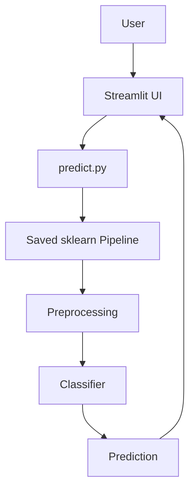

# Loan Approval Prediction

[](https://www.python.org/)
[](https://scikit-learn.org/)
[](https://streamlit.io/)
[](LICENSE)

A production-structured machine learning project that predicts whether a loan application is likely to be approved using the Kaggle Loan Prediction Dataset.

## Project Overview

Loan approval decisions depend on multiple applicant, financial, and credit-history attributes. This project builds an end-to-end supervised classification workflow that explores the data, compares several classifiers, serializes the complete winning pipeline, and exposes it through a Streamlit interface.

This is an educational decision-support project. It must not be used for actual financial decisions or automated credit underwriting.

## Business Problem

Financial institutions need consistent preliminary screening of loan applications. A reliable predictive model can help demonstrate how applicant information relates to historical approval outcomes and provide a basis for further review.

## Machine Learning Objective

Predict `Loan_Status`:

- `Y`: Loan Approved
- `N`: Loan Rejected

The system evaluates Logistic Regression, Decision Tree, Random Forest, and XGBoost using Accuracy, Precision, Recall, F1 Score, and ROC AUC.

## Features

- Reproducible Python 3.11 environment
- Exploratory data analysis notebook
- Missing-value handling inside sklearn pipelines
- Numerical imputation and standardization
- Categorical imputation and one-hot encoding
- Stratified train-test split
- Stratified cross-validation for model selection
- Logistic Regression, Decision Tree, Random Forest, and XGBoost comparison
- Final confusion matrix visualization
- Serialized preprocessing-plus-classifier pipeline using joblib
- Metadata containing model versions and evaluation metrics
- Streamlit prediction interface
- Modular prediction API for dictionary or DataFrame inputs

## Technologies Used

- Python 3.11
- pandas and NumPy
- scikit-learn
- XGBoost
- Matplotlib and Seaborn
- joblib
- Streamlit
- KaggleHub for dataset acquisition

## Dataset

This project uses the [Kaggle Loan Prediction Problem Dataset](https://www.kaggle.com/datasets/altruistdelhite04/loan-prediction-problem-dataset), published by Kaggle user `altruistdelhite04`.

The dataset contains applicant demographics, income, loan details, credit history, property area, and historical loan approval status. The raw files are stored under `data/raw/` for reproducible local execution. Please follow Kaggle's terms and the dataset owner's usage requirements when redistributing or reusing the data.

## Architecture

The system separates data loading, preprocessing, training, inference, and presentation:



See [docs/architecture.md](docs/architecture.md) for the detailed training and inference design.

## Folder Structure

```text
.
├── app/
│   └── streamlit_app.py
├── data/
│   └── raw/
│       ├── train.csv
│       └── test.csv
├── docs/
│   ├── architecture.md
│   ├── design_decisions.md
│   ├── future_scope.md
│   └── project_structure.md
├── models/
│   ├── loan_model.pkl
│   └── model_metadata.json
├── notebooks/
│   └── 01_exploratory_data_analysis.ipynb
├── reports/
│   └── figures/
│       └── confusion_matrix.png
├── src/
│   ├── config.py
│   ├── data_loader.py
│   ├── predict.py
│   ├── preprocessing.py
│   └── train.py
├── .gitignore
├── .python-version
├── LICENSE
├── README.md
└── requirements.txt
```

A file-by-file explanation is available in [docs/project_structure.md](docs/project_structure.md).

## Installation

### Prerequisites

- Python 3.11
- pip
- PowerShell, Command Prompt, or a Unix-like terminal

### Create the environment

PowerShell:

```powershell
py -3.11 -m venv .venv
.\.venv\Scripts\Activate.ps1
python -m pip install --upgrade pip
python -m pip install -r requirements.txt
```

Unix-like shells:

```bash
python3.11 -m venv .venv
source .venv/bin/activate
python -m pip install --upgrade pip
python -m pip install -r requirements.txt
```

## Usage

### Train the model

Run from the project root:

```powershell
python -m src.train
```

Training reads `data/raw/train.csv`, compares the configured models using stratified cross-validation, evaluates the selected model on the holdout test set, and saves:

- `models/loan_model.pkl`
- `models/model_metadata.json`
- `reports/figures/confusion_matrix.png`

### Run a CLI prediction

```powershell
python -m src.predict
```

The CLI loads the saved complete pipeline and prints the predicted class, approval probability, and confidence.

### Launch Streamlit

```powershell
python -m streamlit run app/streamlit_app.py
```

The application calls `src.predict` and never duplicates preprocessing or loads the classifier directly.

## Example Prediction

A prediction response has the following shape:

```text
Predicted class: Loan Approved
Probability: 0.819
Confidence: 0.819
```

The approval probability is the probability assigned to the approved class. Confidence is the probability of the model's selected class. These values are model estimates, not financial guarantees.

## Evaluation Metrics

The current saved model was selected using stratified cross-validation and evaluated on a holdout test split.

| Metric | Holdout score |
|---|---:|
| Accuracy | 0.862 |
| Precision | 0.840 |
| Recall | 0.988 |
| F1 Score | 0.908 |
| ROC AUC | 0.853 |

**Best model:** Logistic Regression

Metrics are based on a small educational dataset and should not be interpreted as production credit-risk performance.

## Documentation

- [Architecture](docs/architecture.md)
- [Project structure](docs/project_structure.md)
- [Design decisions](docs/design_decisions.md)
- [Future scope](docs/future_scope.md)
- [EDA notebook](notebooks/01_exploratory_data_analysis.ipynb)

## Model Interpretation

The selected Logistic Regression model is most dependent on `Credit_History`. A good credit history strongly increases approval probability, while a poor credit history can result in rejection even when applicant income is very high.

The model also learned positive associations for `Married = Yes`, `Property_Area = Semiurban`, and some dependent categories. Graduate education is associated with better historical outcomes than `Not Graduate`.

Applicant income has a positive but relatively weak effect, while loan amount has a slightly negative effect. `Self_Employed = Yes` has a slightly negative association in this historical dataset, which should not be interpreted as a general rule about self-employed applicants. The current model does not explicitly calculate total income, income-to-loan ratio, or repayment burden.

These are historical model associations, not causal conclusions or lending policies. See the EDA notebook for the supporting analysis and limitations.
## Limitations

- The dataset is small and historical.
- Historical approval decisions may contain sampling or institutional bias.
- Probabilities have not been calibrated for financial decision-making.
- No production monitoring, drift detection, fairness governance, or audit workflow is included.
- The model is not validated for regulatory or real-world credit decisions.
- The application is a demonstration and requires additional security hardening before deployment.

## Future Improvements

Potential next steps include probability calibration, subgroup fairness analysis, automated testing and CI/CD, Docker packaging, FastAPI serving, cloud deployment, monitoring, and SHAP-based explainability. See [docs/future_scope.md](docs/future_scope.md).

## Model Artifact Policy

`models/loan_model.pkl` is intentionally not ignored because it is small and allows a fresh GitHub clone to run the Streamlit application immediately. Pickle/joblib artifacts must be treated as trusted files and should not be loaded from untrusted sources.

For larger or frequently retrained models, use Git LFS or a model registry and ignore generated artifacts in the Git repository. The repository should then document the exact artifact download and versioning process.

## License

This project is released under the [MIT License](LICENSE). Dataset usage remains subject to the Kaggle dataset's terms and attribution requirements.

## Author

**Kunal Mishra**

Built as a B.Tech project, internship portfolio project, and demonstration of production-oriented machine learning workflow design.
