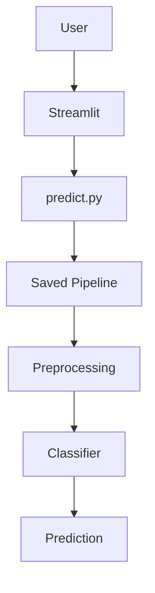
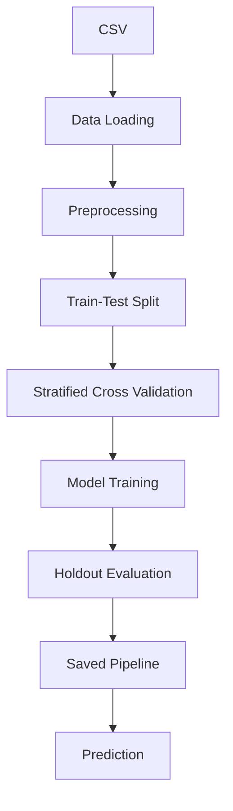

# System Architecture

## System Overview

The project is organized as a small, reproducible machine learning product with separate responsibilities for configuration, data loading, preprocessing, model training, inference, and presentation.

The central deployment artifact is `models/loan_model.pkl`. It contains one sklearn `Pipeline` with the fitted preprocessing transformer followed by the selected classifier. This ensures training-time transformations and inference-time transformations remain identical.

The interface also reads `models/model_metadata.json` for model name, metrics, version information, and target mappings.

## Training Pipeline

1. `src.data_loader` loads and validates `data/raw/train.csv`.
2. `src.preprocessing` separates features and target and defines the reusable `ColumnTransformer`.
3. `src.train` encodes the target and creates a stratified holdout split.
4. Each candidate classifier is combined with a fresh preprocessor inside one sklearn `Pipeline`.
5. Stratified cross-validation on the training split compares Accuracy, Precision, Recall, F1 Score, and ROC AUC.
6. The highest F1 Score is selected, with ROC AUC as the secondary criterion.
7. The selected pipeline is fitted on the training split and evaluated once on the holdout test split.
8. The complete pipeline, metadata, and confusion matrix are saved.

## Inference Pipeline

1. Streamlit collects a loan application using controlled form inputs.
2. `app/streamlit_app.py` calls `src.predict` rather than loading the model directly.
3. `src.predict.validate_input` checks the required feature schema and orders columns consistently.
4. The saved pipeline applies the fitted imputation, scaling, and encoding steps.
5. The classifier returns a predicted class and, when supported, class probabilities.
6. The prediction module converts encoded values to `Loan Approved` or `Loan Rejected`.
7. Streamlit displays the prediction, approval probability, confidence, and educational disclaimer.

## Module Responsibilities

| Module | Responsibility |
|---|---|
| `src/config.py` | Central paths, feature lists, target name, random seed, and output directories |
| `src/data_loader.py` | Read and validate the training CSV |
| `src/preprocessing.py` | Define reusable sklearn preprocessing transformations |
| `src/train.py` | Split data, compare models, evaluate, serialize artifacts, and write metadata |
| `src/predict.py` | Load artifacts, validate inference inputs, predict, and decode labels |
| `app/streamlit_app.py` | Collect user input and present prediction results |
| `notebooks/` | Document exploratory analysis and modeling motivation |
| `reports/` | Store generated evaluation figures |

## Design Decisions

- The complete preprocessing-classifier pipeline is serialized as one artifact.
- `ColumnTransformer` keeps numeric and categorical transformations explicit.
- Imputation is fitted within the pipeline, so cross-validation folds do not share statistics.
- `OneHotEncoder(handle_unknown="ignore")` prevents unseen categories from crashing inference.
- Cross-validation selects the model using training data only; the holdout split remains reserved for final evaluation.
- `pathlib.Path` centralizes filesystem locations and avoids fragile string paths.
- Metadata is saved separately from the binary artifact for human-readable inspection and UI display.
- The Streamlit layer depends on `src.predict`, keeping interface code independent from model internals.
